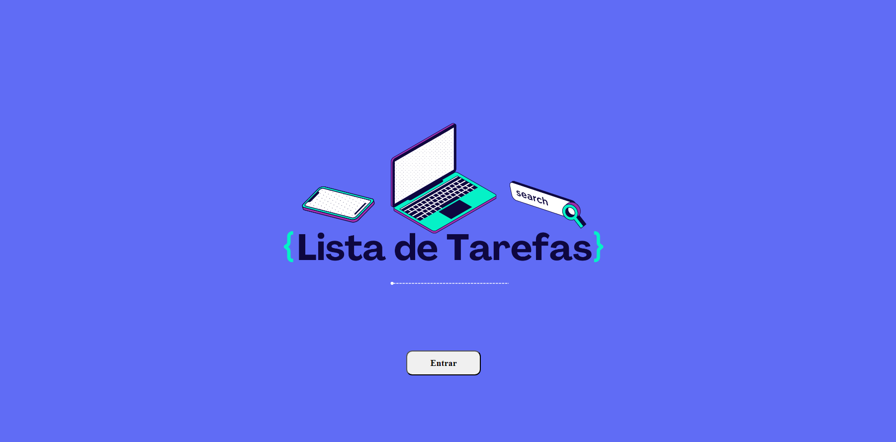
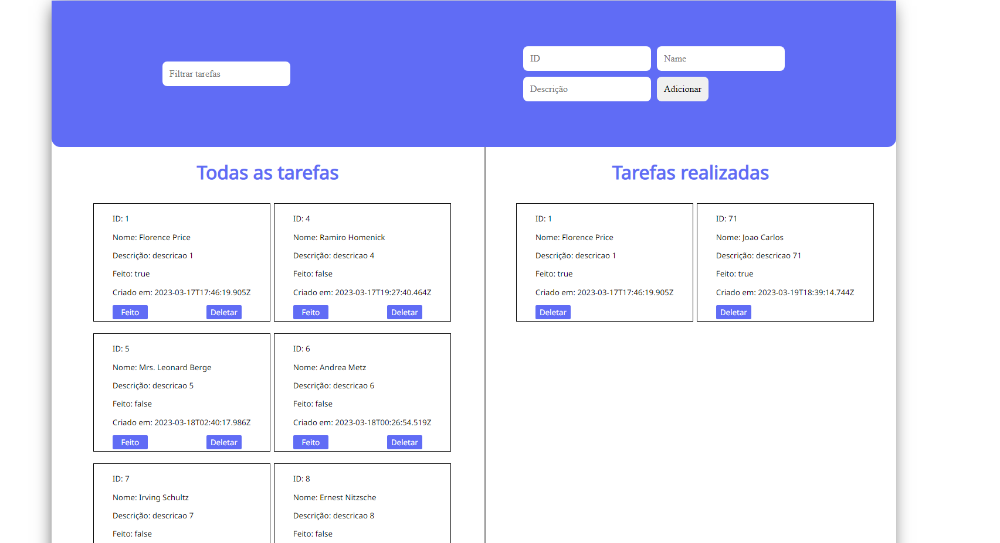

# **Desafio MSB**

O Desafio MSB consiste em criar uma lista de tarefas criada pelo usuário, possuindo duas páginas: Home e a Tasks. O projeto tem como fonte de dados a <a href="https://6415ac7e351c4aed490c5c4f.mockapi.io/api/v1/tasks">API</a> fornecida pela empresa.

## 🔍**Índice**
* [Funcionalidades do projeto](#-funcionalidades-do-projeto)
* [Layout](#-layout)
* [Demonstração](#-demonstração)
* [Como rodar esse projeto?](#-como-rodar-esse-projeto?)
* [Tecnologias utilizadas](#-tecnologias-utilizadas)
* [Pessoas autoras](#-pessoas-autoras)


## 💻 **Funcionalidades do Projeto**
- [x] Adicionar tarefas à lista.
- [x] Marcar tarefas como concluídas.
- [x] Excluir tarefas.
- [x] Filtrar tarefas por status (todas, ativas e concluídas).


## 🖼 **Layout**



## 🎯 **Demonstração**
[Link demonstração](site)

## 🕹 **Como rodar esse projeto?**

```
# Clone esse repositório
$ git clone https://github.com/brunomaschietto/desafio-msb

# Acesse a pasta do projeto no seu terminal
$ cd desafio-msb

# Instale as dependências
$ npm install

# Execute a aplicação
$ npm run dev
```

## ⚙️ **Tecnologias Utilizadas**

1. [Vue](https://vuejs.org/)
2. [Vue CLI](https://cli.vuejs.org/)
3. [Vue Router](https://router.vuejs.org/)
4. [Vuex](https://vuex.vuejs.org/)
5. [SCSS](https://sass-lang.com/)

## 👩🏻‍💻 **Pessoas autoras**

<p>Bruno Maschietto Simões Cruz</p>

[LinkedIn](https://www.linkedin.com/in/bruno-maschietto/)